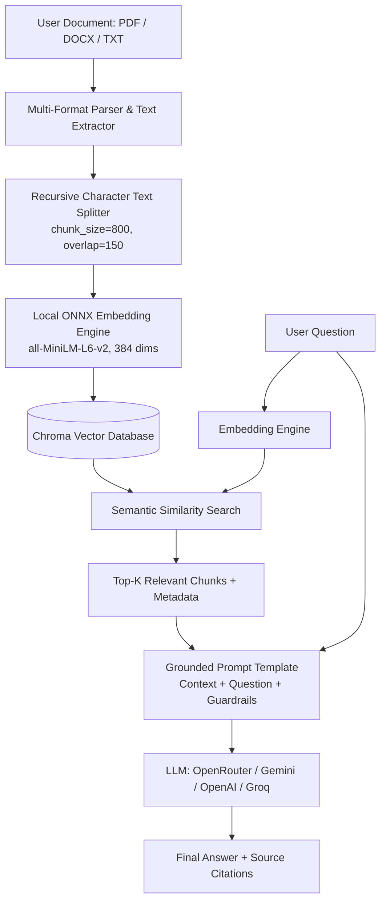

# 📚 Real-Life Question-Answering System Using RAG (Retrieval-Augmented Generation)

> **Built for Generative AI Engineering Portfolio & Production Showcase**  
> A production-ready, document-grounded Question-Answering system that enables users to upload custom documents (**PDF**, **DOCX**, **TXT**, **MD**) and receive strictly grounded, verifiable answers with source citations.

---

## 🌟 Why is this "Real-Life RAG" (vs Toy Tutorials)?

Most beginner tutorials hardcode a static string inside a Python script. In a **real-life production RAG**, the pipeline must handle real-world challenges:

1. **Dynamic File Uploads**: Users can upload real business documents (PDFs, Word documents, text reports).
2. **Lossless Semantic Chunking**: Implements `RecursiveCharacterTextSplitter` with chunk overlap so sentence boundaries and semantic contexts aren't severed.
3. **Zero-Cost, Local Dense Embeddings**: Employs `all-MiniLM-L6-v2` via ONNX runtime—runs 100% locally on CPU without paid embedding API keys or external network latency.
4. **Strict Document Grounding (Anti-Hallucination)**: Instructs the LLM to strictly decline answering if the information is absent from the context, preventing fabrication.
5. **Source Attribution & Citations**: Every generated response includes an inspectable list of source chunks with page numbers and metadata so users can verify the evidence.
6. **Multi-Provider LLM Flexibility**: Switch between **OpenRouter**, **Google Gemini**, **OpenAI**, and **Groq** via a simple dropdown or `.env` configuration.

---

## 🏗️ Architecture Pipeline



---

## 📦 What You Need to Install

All dependencies are pinned in [`requirements.txt`](file:///c:/Users/HP/OneDrive/Desktop/RAG-Question_Answer/requirements.txt).

Run the following command in your terminal:

```bash
pip install -r requirements.txt
```

### Key Libraries Included:
- **`langchain` & `langchain-core`**: Modern pipeline orchestration and LCEL chains.
- **`chromadb` & `onnxruntime`**: High-performance local vector store and CPU embedding execution.
- **`pypdf` & `pymupdf`**: Fast, reliable PDF text and page extraction.
- **`python-docx`**: Word document parsing.
- **`langchain-openrouter` & `langchain-google-genai`**: Multi-model integration.
- **`streamlit`**: Modern interactive web interface.

---

## 🚀 How to Run the Project

### Option 1: Modern Interactive Web Application (Recommended)
Launch the Streamlit app:
```bash
streamlit run app.py
```
This opens `http://localhost:8501` in your browser where you can:
- Drag and drop your own PDF, DOCX, or TXT file.
- View real-time document metrics (pages, characters, total chunks generated).
- Inspect the chunks stored in the Chroma vector database.
- Chat with your document and expand the **"📚 View Retrieved Sources"** drawer for full transparency.
- Switch models or paste fresh API keys directly in the sidebar.

---

### Option 2: Standalone Terminal / CLI Script
If you prefer running in the console:
```bash
python RAG.py
```
1. It prompts you for your document path (or press `Enter` to use the built-in demo [`sample_document.txt`](file:///c:/Users/HP/OneDrive/Desktop/RAG-Question_Answer/sample_document.txt)).
2. It visually executes:
   - **Step 1**: Document Ingestion
   - **Step 2**: Recursive Chunking
   - **Step 3**: Vector Store Indexing
   - **Step 4**: LLM Configuration
   - **Step 5**: Interactive Q&A loop with source citations.

---

## 🔑 Setting Up Your API Keys

Create or update your [`.env`](file:///c:/Users/HP/OneDrive/Desktop/RAG-Question_Answer/.env) file in the root folder:

```env
# OpenRouter (Supports free models like meta-llama/llama-3.2-3b-instruct:free)
OPENROUTER_API_KEY="your-openrouter-key"

# OR Google Gemini (Free tier available via Google AI Studio)
GOOGLE_API_KEY="your-gemini-key"

# OR OpenAI
OPENAI_API_KEY="your-openai-key"

# OR Groq
GROQ_API_KEY="your-groq-key"
```

> **Tip**: You can also enter or paste your API key directly inside the Streamlit web sidebar at any time!

---

## 💡 Gen AI Intern Interview Cheatsheet

| Concept | Explanation |
| :--- | :--- |
| **Why Chunking?** | LLMs have finite context limits and lower attention precision over huge texts. Chunking divides long documents into focused passages. |
| **Why Chunk Overlap?** | An overlap (e.g., 150 characters) ensures that an important idea spanning across chunk boundaries is not cut in half. |
| **Why Dense Embeddings?** | Dense vectors map words and semantic concepts into continuous multi-dimensional space, enabling conceptual search (e.g. matching "salary" with "compensation"). |
| **What is Top-K?** | The number of most relevant chunks retrieved from the vector database to be provided as context to the LLM. |
| **Hallucination Prevention** | Achieved by explicit system prompt guardrails instructing the LLM: *"Use ONLY the retrieved context. If not found, say 'I cannot find the answer in the document.'"* |

---

## 📂 Project Structure

```
RAG-Question_Answer/
├── app.py                # Modern Streamlit Web Application (Drag & drop upload + chat)
├── RAG.py                # Standalone CLI Terminal RAG script
├── rag_engine.py         # Reusable core engine (Loaders, Chunkers, Chroma, LLMs)
├── sample_document.txt   # Pre-configured demo document for instant 1-click testing
├── requirements.txt      # List of dependencies
├── .env                  # API keys configuration
└── README.md             # Project documentation and interview guide
```
